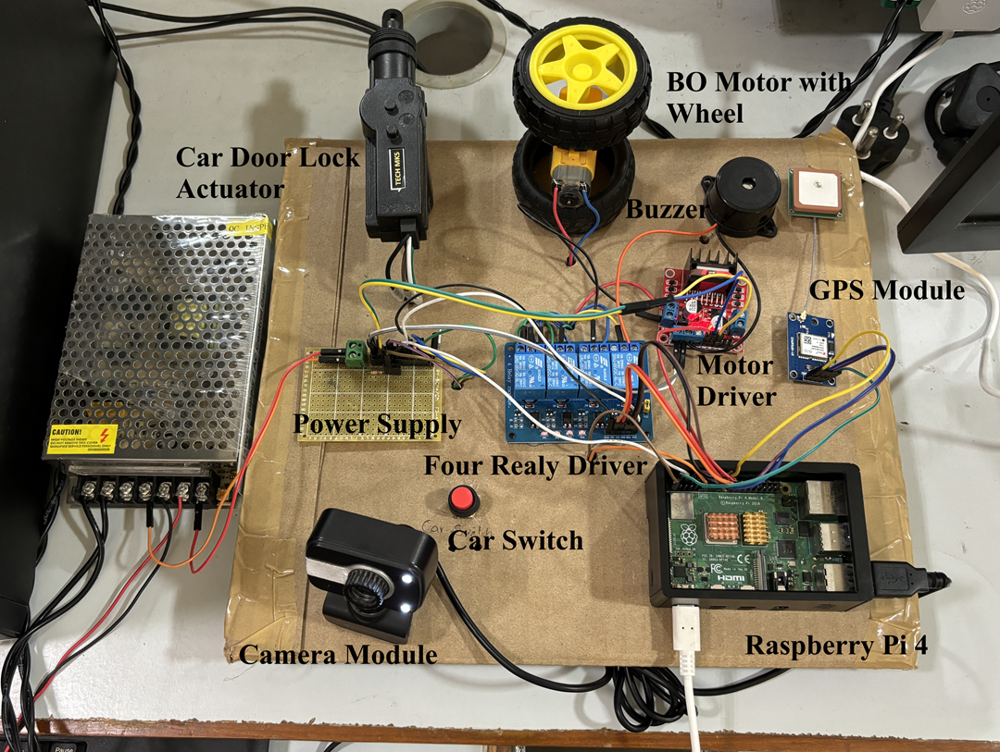

# Car-Anti-Theft-with-Facial-Recognition
Car anti-theft system designed for Raspberry Pi with in-cabin camera based facial recognition and telegram-based live alerts. The anti-theft system also includes a fail-safe door lock, electronic immobilizer and a sound alarm system.

## You can download Rasperry Pi Image from here - https://github.com/Qengineering/RPi-Bullseye-DNN-image

## Installation

Before running the project, install the required Python packages using:

```bash
pip install -r requirements.txt
```

## Demo 
  ```bash
  python CarLock_FaceApp.py
  ``` 
> **Note:** While running on Raspberry Pi, comment out the commented lines. Place all trusted users images in KnownUser directory. Replace your created Telegram Bot token ID in Configuration class. For more details on creating and using your own Telegram Bot, visit: https://core.telegram.org/bots/features#botfather.

Don't forget to star the repo if it is helpful for your research 

## Results
<table>
  <tr>
    <td align="center">
      <br>
      <em>Figure 1: Hardware Setup</em>
    </td>
    <td align="center">
      <br>
      <em>Figure 2: Telegram Alerts</em>
    </td>
  </tr>
</table>

## Reference 
* https://github.com/xuexingyu24/MobileFaceNet_Tutorial_Pytorch - For Facial Recoginition

@unpublished{,
  title   = {Car Anti-Theft System using Driver Facial Biometrics Authentication and Telegram Alert},
  author  = {Kumar, S. and Karthika, R.},
  note    = {Presented at the 3rd International Conference on Power Engineering and Intelligent Systems (PEIS 2025)},
  year    = {2025}
}


